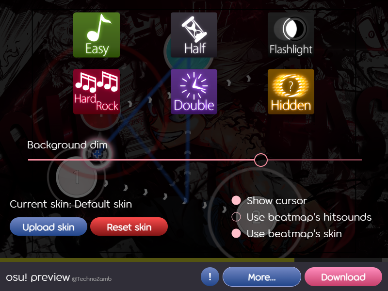

# osu! preview

osu! preview is a browser extension that allows you to preview osu!standard beatmaps in your browser. It correctly plays most maps, renders 99% similarly to the osu! client, gives you a seekbar to jump to any part of the map, allows you to adjust all volumes and background dim, it has support for mods (EZ, HR, HT, DT, HD, FL), skins, and autoplay.
Built on plain HTML, CSS and JavaScript. Libraries used: [zip.js](https://github.com/gildas-lormeau/zip.js) and [webextension-polyfill](https://github.com/mozilla/webextension-polyfill).

Get it on [Chrome Web Store](https://chromewebstore.google.com/detail/osu-preview/gnioipmhffmpigpjdoeoadgbohcjcddp) and [Firefox Add-ons](linktobeadded).

## Screenshots

    
    
    

## Controls

 - `Spacebar` - Play/pause
 - `Mouse wheel` - Volume (hover over each channel to change its volume individually)
 - `Left/Right arrows` - Rewind/skip 3 seconds
 - `Number/Numpad 0-9` - Jump to 0-90% of the beatmap
 - `Tab` - Open/close 'More' panel

Buttons used to activate/deactivate mods in osu! also work in osu! preview.

 - `Q` - EZ, `E` - HT, `A` - HR, `D` - DT, `F` - HD, `G` - FL

## How it works

The extension downloads the map you are on to local storage using the chosen download provider and stores it for an hour, so that you don't need to download it again in case you want to actually keep it, as it gives you the local version when pressing the 'Download' button on the extension. Then, it unzips the .osz (because most osu! file formats are actually just compressed archives) and reads the files it needs. Your skin and settings are saved to local storage as well.

## Report a problem

If you see anything that shouldn't be happening, please let me know however you prefer: open an issue on this repository, DM me on osu!, or write an email at technozamb19@gmail.com. If any of the folllowing apply, please specify:

- the link to the map you were on when the issue occured;
- the minute and second into the map when the issue occured;
- any other useful information to reproduce the issue.

## Development

Being plain JavaScript, you don't actually compile anything when developing; but, since Chrome and Firefox extensions are slightly different (they have slightly different manifest files), I've built some helper commands which automate the process of creating the folders for each browser.

First of all, run `npm install` at the root of the project directory to install all the dependencies. Then, you can run the following commands:

- `npm run build:chrome`: clears `dist/chrome/`, copies the `src/` and `assets/` folders into it, and copies `manifest.chrome.json` into `dist/chrome/manifest.json`.

- `npm run build:firefox`: clears `dist/firefox/`, copies the `src/` and `assets/` folders into it, and copies `manifest.firefox.json` into `dist/firefox/manifest.json`.

- `npm run zip:firefox`: runs `build:firefox`, then zips the `dist/firefox/` folder into `dist/firefox.zip`; this is useful because when testing an extension in Firefox, you need to upload it zipped.

- `npm run build:all`: runs `build:chrome` and `zip:firefox`.

- `npm run clean`: removes the `dist/` folder.

Once the distribution folder is created, you can install the local extension by following your specific browser's procedures.
